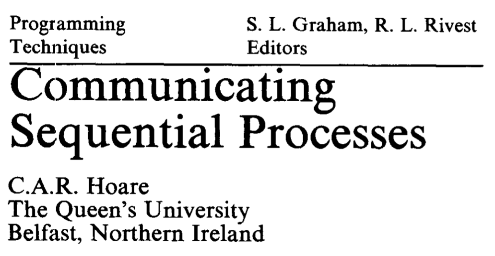
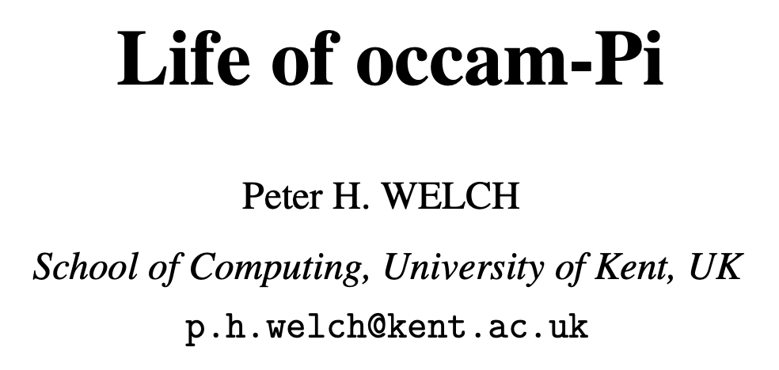

{}



{}

In 1978, Tony Hoare wrote the Communicating Sequential Proccesses paper.

Its one of the most cited computer science papers.

It does a good job of laying out the model but less so as a critique of modern software patterns (mostly because it was written in 1978)

Instead, I'm going to use some quotes from a paper called The Life of Occam-Pi and we'll come back to the CSP model later with some go code.

{}

---



{}

Occam-pi is a language directly descended from CSP and is part of the same family tree as Go.

The language itself is mostly used in academia.

But this paper does a good job at critiquing the shared memory locking style of concurrency.

{}

---

_"Concurrency is a powerful tool for simplifying the description of systems. Performance spins out from this, but is not the primary focus."_

{}

Concurrency is about the design of the program not about performance.

Performance is a by-product of good concurrent design.

Again, we have this idea of concurrency being about good design and structure of the code.

{}

---

_"Traditional approaches to concurrency (e.g. shared data and locks) conflict with some basic assumptions of, and our intuition for, sequential programming. They are, not surprisingly, very difficult to use."_

{}

This is because we are forced to deal with low-level implementation details of the computer.

It's unlikely that Mutexes are really part of the core problem we are trying to model with our code.

They are a solution to the problem of shared memory.

They aren't fundamental to writing concurrent programs.

i.e. We have a leaky abstraction.

{}

---

### Accidental vs Essential complexity

{}

This is really accidental vs essential complexity

A mental model from Fred Brook's No Silver Bullet essay.

Essential complexity is core to the problem you're trying to solve.

Accidental complexity is complexity that developers make for themselves.

{}

---

```go
func Poller(res *Resources) {
    for {
        // Get the least recently-polled Resource and mark it as being polled
        res.lock.Lock()
        var r *Resource
        for _, v := range res.data {
            if v.polling { continue }
            if r == nil || v.lastPolled < r.lastPolled { r = v }
        }
        if r != nil { r.polling = true }
        res.lock.Unlock()
        if r == nil { continue }

        // Actually do the polling logic here

        // Update the resource metadata
        res.lock.Lock()
        r.polling = false
        r.lastPolled = time.Nanoseconds()
        res.lock.Unlock()
    }
}
```

#### _The Go Blog - [Share Memory By Communicating](https://blog.golang.org/codelab-share)_

{}

This example is a program that polls a list of URLs using locks.

This doesn't even contain the polling logic, its purely defensive code to protect against races.

This is all accidental complexity from a leaky abrstraction.

{}

---

### Shared memory and locking are global state.

{}

This is not actually in the paper, but I think its an important intuition.

It took me a while to actually internalise this.

{}

{}