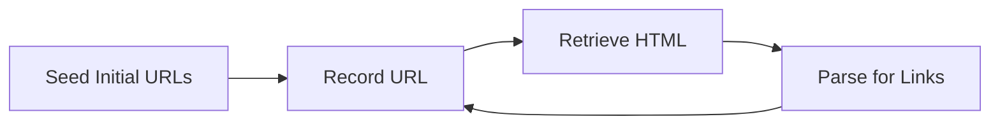

{}

### Writing our web indexer

---



{}

Remember the design we had.

The recorder sends messages to the retriever.

The retriever sends the HTML to the link parser.

And the link parser sends a list of links to the recorder.

Let's go through each of these processes

{}

---

```go [1-7|1,7|2,6|3,5|4]
func RetrieveContent(urls <-chan string, retrieved chan<- Page) {
	for url := range urls {
		if resp, err := http.Get(url); err == nil {
			retrieved <- Page{address: url, content: resp.Body}
		}
	}
}
```

[liamawhite/go-concurrency-example](https://github.com/liamawhite/go-concurrency-example)

{}

CLICK THROUGH!

{}

---

```go [1-4|7-18]
func ParseForLinks(retrieved <-chan Page, record chan<- []string) {
	for page := range retrieved {
		record <- parse(page)
	}
}

func parse(page Page) []string {
	// Use goquery because I'm lazy!
	doc, _ := goquery.NewDocumentFromReader(page.content)
	page.content.Close()
	res := make([]string, 0)
	doc.Find("a").Each(func(_ int, s *goquery.Selection) {
		link, _ := s.Attr("href")
		// Do some URL contruction magic
		res = append(res, link)
	})
	return res
}
```

[liamawhite/go-concurrency-example](https://github.com/liamawhite/go-concurrency-example)

{}

CLICK THROUGH!

{}

---

```go [1,16|2,5,13,15|4-14]
func VisitedPageTracker(pending chan<- string) chan<- []string {
	record := make(chan []string)
	visitedPages := map[string]bool{}
	go func() {
		for pages := range record {
			for _, page := range pages {
				if !visitedPages[page] {
					fmt.Println("recording page", page)
					visitedPages[page] = true
					pending <- page
				}
			}
		}
	}()
	return record
}
```

[liamawhite/go-concurrency-example](https://github.com/liamawhite/go-concurrency-example)

{}

CLICK THROUGH!

{}

---

```go [2-5,7,12|6,12,13|7,10,13]
func main() {
	// Pending must be buffered because the pipeline is circular and there are multiple links per page.
	// This is preferred over adding to pending concurrently as it sets an upper bound on memory usage.
	// There is an assumption here that one page will not contain more than 10000 links.
	pending := make(chan string, 10000)
	retrieved := make(chan Page)
	record := VisitedPageTracker(pending)

	// Send initial urls to be recorded
	go func() { record <- urls }()

	go RetrieveContent(pending, retrieved)
	go ParseForLinks(retrieved, record)

	// Run the code for 5 seconds.
	// Again, I'm lazy and this is a contrived example.
	time.Sleep(time.Second * 5)
}

```

[liamawhite/go-concurrency-example](https://github.com/liamawhite/go-concurrency-example)

{}

CLICK THROUGH!

{}

{}
